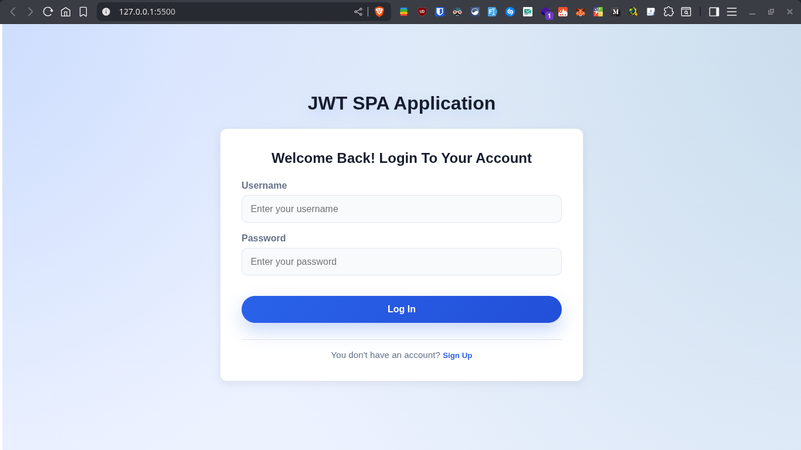
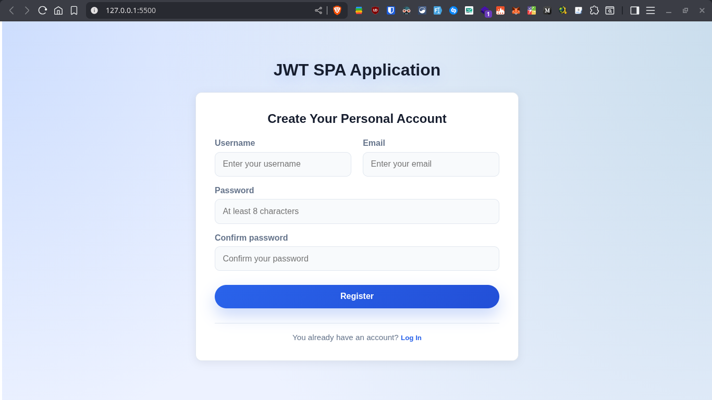
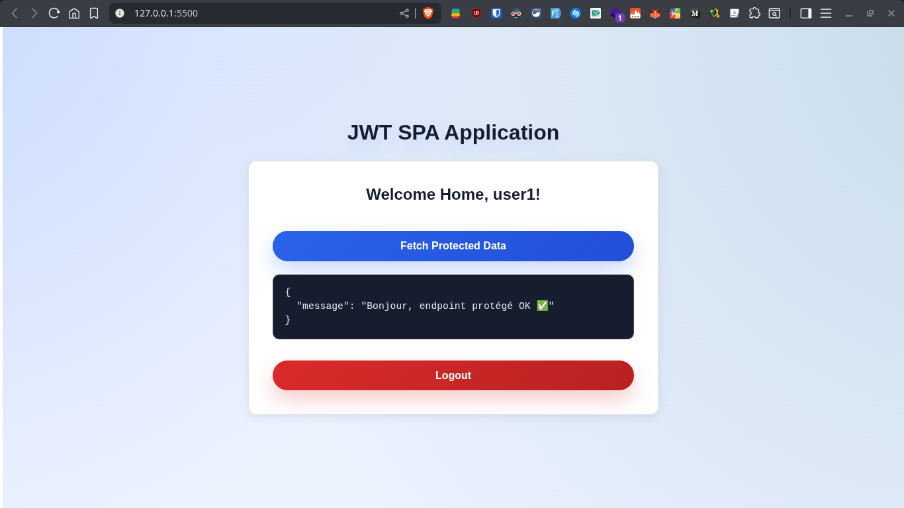
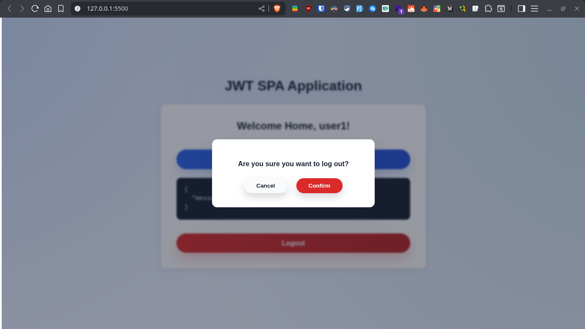

# JWT Authentication Lab Report

## Overview

I built this lab to demonstrate a complete JWT-based authentication flow using a Spring Boot backend and a small vanilla JavaScript single-page application. My goal is to show every critical piece of the stack, explain why each decision matters, and make it easy for anyone visiting the repository to evaluate the project quickly.

## Table of Contents

- [Project Structure](#project-structure)
- [Backend (Spring Boot)](#backend-spring-boot)
  - [Security Configuration](#security-configuration)
  - [Application Configuration](#application-configuration)
  - [JWT Service](#jwt-service)
  - [JWT Filter](#jwt-filter)
  - [User Service Layer](#user-service-layer)
  - [REST Controller](#rest-controller)
  - [Global Exception Handling](#global-exception-handling)
- [Frontend (Vanilla JS SPA)](#frontend-vanilla-js-spa)
  - [Static HTML Shell](#static-html-shell)
  - [Core SPA Script](#core-spa-script)
    - [Utility Builders](#utility-builders)
    - [API Helpers](#api-helpers)
    - [Page Builders](#page-builders)
    - [App Lifecycle](#app-lifecycle)
  - [Styling](#styling)
- [Execution Walkthrough](#execution-walkthrough)
- [Run It Yourself](#run-it-yourself)
- [Conclusion](#conclusion)

## Project Structure

I kept the project tidy so each layer is easy to find:

```
jwt-auth-lab/
├── client/
│   ├── index.html
│   ├── main.js
│   └── style.css
├── jwt-auth-backend/
│   ├── pom.xml
│   ├── src/main/java/ma/enset/jwtauthlab/
│   │   ├── JwtAuthBackendApplication.java
│   │   ├── config/
│   │   ├── controller/
│   │   ├── dto/
│   │   ├── entity/
│   │   ├── exception/
│   │   ├── filter/
│   │   ├── mapper/
│   │   └── service/
│   └── src/main/resources/
└── screenshots/
		├── login-form.png
		├── register-form.png
		├── home-after-auth.png
		└── logout-modal.png
```

The backend is a Maven project targeting Java 21. The frontend is a lightweight SPA that can be served by any static server (I used VS Code Live Server during development).

## Backend (Spring Boot)

The backend secures every endpoint except `register` and `login`. I separated responsibilities into config, service, and controller packages so that the security flow stays readable.

### Security Configuration

The security chain enables CORS for the SPA, disables CSRF (because JWTs make requests stateless), and wires the custom JWT filter before username/password authentication.

```java
@Bean
public SecurityFilterChain filterChain(HttpSecurity http) throws Exception {
		http
				.cors(Customizer.withDefaults())
				.csrf(AbstractHttpConfigurer::disable)
				.sessionManagement(session ->
						session.sessionCreationPolicy(SessionCreationPolicy.STATELESS)
				)
				.authorizeHttpRequests(req -> req
						.requestMatchers("/api/auth/login", "/api/auth/register").permitAll()
						.anyRequest().authenticated()
				)
				.addFilterBefore(jwtAuthFilter, UsernamePasswordAuthenticationFilter.class);
		return http.build();
}
```

**Why**: Stateless sessions force clients to provide the token each time, which is exactly what we want in a JWT architecture. Adding the filter before the default Spring filter lets me validate tokens early and populate the security context.

### Application Configuration

To keep passwords safe I always encode them and delegate authentication to Spring Security’s DAO provider.

```java
@Bean
public AuthenticationProvider authenticationProvider() {
		DaoAuthenticationProvider authProvider = new DaoAuthenticationProvider();
		authProvider.setUserDetailsService(userDetailsService);
		authProvider.setPasswordEncoder(passwordEncoder());
		return authProvider;
}
```

**Why**: Separating the provider keeps my controller thin—authentication is handled by the framework, and I reuse the same encoder everywhere.

### JWT Service

Token generation signs claims (roles + username) with a symmetric key and enforces expiration plus issuer validation.

```java
public String generateToken(String username, Map<String, Object> claims) {
		Date now = new Date();
		Date exp = new Date(now.getTime() + expirationMs);

		return Jwts.builder()
				.setClaims(claims)
				.setSubject(username)
				.setIssuedAt(now)
				.setExpiration(exp)
				.setIssuer(issuer)
				.setId(UUID.randomUUID().toString())
				.signWith(key, SignatureAlgorithm.HS256)
				.compact();
}
```

**Why**: Including an ID and issuer prevents token replay across environments. I read secrets from `application.properties`, but on a real deployment I would externalize them using environment variables (e.g., `APP_JWT_SECRET`).

### JWT Filter

The filter reads the `Authorization` header, validates the token, then hydrates the security context so downstream endpoints see the authenticated user.

```java
protected void doFilterInternal(HttpServletRequest request, HttpServletResponse response, FilterChain chain)
				throws ServletException, IOException {
		final String authHeader = request.getHeader("Authorization");
		if (authHeader == null || !authHeader.startsWith("Bearer ")) {
				chain.doFilter(request, response);
				return;
		}

		final String token = authHeader.substring(7);
		String username = jwtService.extractUsername(token);

		if (username != null && SecurityContextHolder.getContext().getAuthentication() == null) {
				UserDetails user = userDetailsService.loadUserByUsername(username);
				if (jwtService.isTokenValid(token, user.getUsername())) {
						var authToken = new UsernamePasswordAuthenticationToken(user, null, user.getAuthorities());
						authToken.setDetails(new WebAuthenticationDetailsSource().buildDetails(request));
						SecurityContextHolder.getContext().setAuthentication(authToken);
				}
		}
		chain.doFilter(request, response);
}
```

**Why**: I allow the filter chain to continue even for invalid tokens. Spring Security will later block the request, and I avoid leaking information about why the token failed.

### User Service Layer

The service shields the controller from persistence details. I validate uniqueness, encode passwords, map DTOs, and expose read-only queries.

```java
public UserResponse registerUser(RegisterRequest request) {
		if (userRepository.existsByUsername(request.getUsername())) {
				throw new UserAlreadyExistsException("Username is already taken: " + request.getUsername());
		}
		if (userRepository.existsByEmail(request.getEmail())) {
				throw new UserAlreadyExistsException("Email is already in use: " + request.getEmail());
		}

		String encodedPassword = passwordEncoder.encode(request.getPassword());
		User user = userMapper.toEntity(request, encodedPassword);
		User savedUser = userRepository.save(user);
		return userMapper.toDto(savedUser);
}
```

**Why**: Centralizing validation and mapping keeps the REST controller concise and makes it easier to reuse the service for future features (e.g., admin dashboards).

### REST Controller

The controller exposes `register`, `login`, and a sample protected endpoint. Spring Security handles the heavy lifting as soon as a token is validated.

```java
@PostMapping("/auth/login")
public ResponseEntity<LoginResponse> login(@Valid @RequestBody LoginRequest request) {
		var auth = new UsernamePasswordAuthenticationToken(request.getUsername(), request.getPassword());
		authenticationManager.authenticate(auth);

		UserDetails userDetails = userDetailsService.loadUserByUsername(request.getUsername());
		UserResponse user = userService.findByUsername(request.getUsername());
		String token = jwtService.generateToken(userDetails.getUsername(), Map.of("roles", userDetails.getAuthorities()));

		LoginResponse response = new LoginResponse(token, user.getUsername(), user.getEmail());
		return ResponseEntity.ok(response);
}
```

**Why**: I separate authentication (`AuthenticationManager`) from my domain response. After successful authentication I fetch extra user data to populate the response and show it in the SPA.

### Global Exception Handling

Custom exceptions return consistent JSON payloads. Validation errors expose field-level messages so the frontend can surface them directly to the user.

```java
@ExceptionHandler(MethodArgumentNotValidException.class)
public ResponseEntity<ErrorResponse> handleValidationErrors(MethodArgumentNotValidException ex, HttpServletRequest request) {
		Map<String, String> validationErrors = new HashMap<>();
		ex.getBindingResult().getAllErrors().forEach(error -> {
				String fieldName = ((FieldError) error).getField();
				validationErrors.put(fieldName, error.getDefaultMessage());
		});

		ErrorResponse error = new ErrorResponse(
				LocalDateTime.now(),
				HttpStatus.BAD_REQUEST.value(),
				"Bad Request",
				"Validation failed",
				request.getRequestURI(),
				validationErrors
		);
		return ResponseEntity.status(HttpStatus.BAD_REQUEST).body(error);
}
```

**Why**: Having a consistent error schema makes the frontend logic simpler—`error.data.validationErrors` is all I need to check.

## Frontend (Vanilla JS SPA)

The client is a single HTML file paired with a script that builds each view dynamically. I avoided frameworks to keep the lab focused on authentication logic.

### Static HTML Shell

The HTML only loads styles, Toastify (for notifications), and the SPA script.

```html
<!DOCTYPE html>
<html lang="en">
  <head>
    <meta charset="UTF-8" />
    <title>JWT Auth App</title>
    <link rel="stylesheet" href="style.css" />
    <script defer src="https://cdn.jsdelivr.net/npm/toastify-js"></script>
    <script defer src="main.js"></script>
  </head>
  <body>
    <div id="root"></div>
  </body>
</html>
```

**Why**: A slim HTML shell keeps deployment trivial. Any static host can serve the page without build steps.

### Core SPA Script

I use an IIFE to avoid leaking variables globally. Inside the closure I split the logic into utilities, API helpers, and page builders.

#### Utility Builders

`buildInput` and `buildCallToAction` keep form rendering DRY. `showToast` standardizes notifications with Toastify.

```javascript
function buildInput(options) {
  const inputWrapper = document.createElement("div");
  const label = document.createElement("label");
  const input = document.createElement("input");
  inputWrapper.classList.add("input-group");
  if (options.name) {
    label.setAttribute("for", options.name);
    label.textContent =
      options.name.charAt(0).toUpperCase() +
      options.name.slice(1).replace("-", " ");
    input.setAttribute("id", options.name);
  }
  for (const opt in options) {
    input.setAttribute(opt, options[opt]);
  }
  inputWrapper.append(label, input);
  return inputWrapper;
}
```

**Role**: These helpers keep markup generation consistent and make the form layout easier to adjust.

#### API Helpers

Centralized fetch wrappers convert HTTP errors into a custom `ApiError` so I can handle them uniformly in each view.

```javascript
async function handleApiResponse(response) {
  const data = await response.json();
  if (!response.ok) {
    throw new ApiError(
      data.message || "An API error occurred",
      data,
      response.status
    );
  }
  return data;
}

async function Login(username, password) {
  const response = await fetch(`${baseURL}/auth/login`, {
    method: "POST",
    headers: { "Content-Type": "application/json" },
    body: JSON.stringify({ username, password }),
  });
  const result = await handleApiResponse(response);
  localStorage.setItem("token", result.token);
  localStorage.setItem("username", result.username);
}
```

**Role**: Converting every fetch into a promise that either returns JSON or throws an `ApiError` keeps the UI logic clean and lets me display specific validation feedback.

#### Page Builders

`buildLogin`, `buildRegister`, and `buildHome` wipe the body container and paint the appropriate screen. Each form listens for submit events and calls the API helpers.

```javascript
function buildLogin() {
  destructElement(body);
  const form = document.createElement("form");
  const usernameInput = buildInput({
    type: "text",
    name: "username",
    placeholder: "Enter your username",
    required: true,
  });
  const passwordInput = buildInput({
    type: "password",
    name: "password",
    placeholder: "Enter your password",
    required: true,
  });

  form.addEventListener("submit", async (event) => {
    event.preventDefault();
    const formData = new FormData(form);
    try {
      await Login(formData.get("username"), formData.get("password"));
      showToast("Login successful!");
      buildHome();
    } catch (error) {
      showToast(error.data.message || "Login failed.", true);
    }
  });

  form.append(usernameInput, passwordInput, submitButton);
  container.append(title, form, callToAction);
  body.append(container);
}
```

**Role**: Each builder owns its DOM and state transitions. This pattern keeps the SPA logic simple without needing React or Vue.

`buildHome` demonstrates how the protected endpoint works and gives the user control over their session.

```javascript
fetchDataButton.addEventListener("click", async () => {
  try {
    const data = await fetchProtectedData();
    dataDisplay.textContent = JSON.stringify(data, null, 2);
    showToast("Data fetched successfully!");
  } catch (error) {
    if (
      error instanceof ApiError &&
      (error.status === 401 || error.status === 403)
    ) {
      handleLogout("Session expired. Please log in again.", true);
    } else {
      showToast(error.message || "Failed to fetch data.", true);
      dataDisplay.textContent = "Failed to fetch data.";
    }
  }
});
```

**Role**: I explicitly handle 401/403 to auto-logout expired tokens, which is a common UX expectation.

#### App Lifecycle

Everything starts with `startApp`. It checks `localStorage` for an existing token and renders the correct screen.

```javascript
function startApp() {
  const title = document.createElement("h1");
  title.textContent = "JWT SPA Application";
  header.append(title);

  const token = localStorage.getItem("token");
  if (token) {
    buildHome();
  } else {
    buildLogin();
  }
}
```

**Role**: This gives the app a seamless refresh experience—if the token is still valid the user keeps their session.

### Styling

I designed the UI with CSS variables and modern shadows to keep the lab visually polished.

```css
:root {
  --brand: #2563eb;
  --danger: #dc2626;
  --surface: #ffffff;
  --text: #0f172a;
}

.form-container,
.panel {
  background: var(--surface);
  border-radius: 12px;
  padding: 2.25rem;
  box-shadow: 0 4px 15px rgba(15, 23, 42, 0.08);
  border: 1px solid #e2e8f0;
}
```

**Why**: Using variables lets me tweak the palette quickly and is a good habit for larger projects.

## Execution Walkthrough

Here are the key screens captured from the running app:






## Run It Yourself

I tested everything on Linux with Java 21, Maven, Node 18, and MySQL 8. To reproduce the environment on another machine:

1. **Clone the repository**
   ```bash
   git clone https://github.com/OtmaneTouhami/jwt-auth-lab.git
   cd jwt-auth-lab
   ```
2. **Configure the database**
   - Create a MySQL database called `jwt_auth_db` (or change `spring.datasource.url` in `jwt-auth-backend/src/main/resources/application.properties`).
   - Update the MySQL username/password in the same file or, preferably, export them as environment variables and reference them using Spring’s `${...}` syntax.
   - Replace `app.jwt.secret` with a strong random string or load it from an environment variable.
3. **Run the backend**
   ```bash
   cd jwt-auth-backend
   ./mvnw spring-boot:run
   ```
   The API listens on `http://localhost:8080`.
4. **Serve the frontend**
   - From another terminal run a static server inside `client/` (for example with VS Code Live Server or Python):
     ```bash
     cd client
     python3 -m http.server 5500
     ```
   - Open `http://localhost:5500` in the browser.
5. **Test the flow**
   - Register a new account.
   - Log in to receive the JWT stored in `localStorage`.
   - Call the protected `/hello` endpoint via the SPA and observe the response rendered in the UI.

### Optional Enhancements I Considered

- Move secrets into environment variables or Spring Cloud Config.
- Add refresh tokens and revocation to harden long-lived sessions.
- Persist roles in a dedicated table instead of an element collection for more complex authorization.

## Conclusion

This lab demonstrates the core building blocks of JWT authentication: secure password storage, token issuing, request filtering, and a client that handles successes and failures gracefully. Writing everything from scratch forced me to understand each layer, which is the main learning objective of this assignment. I am confident that this structure can be extended with more advanced features if needed.
